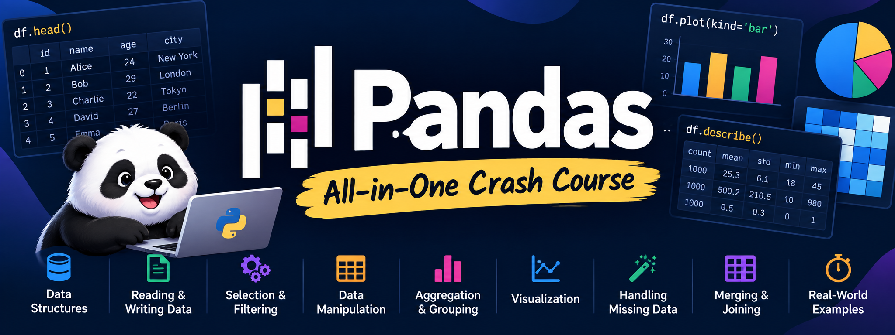

<p align="center">
  
</p>

# Pandas — All-in-One Crash Course

This is a **from-zero → advanced practical Pandas** course. The goal is that after this, you can take a CSV/Excel/JSON dataset, clean it, manipulate it, analyze it, join multiple datasets, reshape it, and export the result without constantly looking up syntax.

The examples use the current **pandas 3.0.x API**. pandas 3.0 introduced a dedicated default string dtype and made Copy-on-Write the default, so a few older tutorials behave differently. ([1](https://pandas.pydata.org/community/blog/pandas-3.0.html))

---

# 0. The mental model

Think of Pandas as:

```text
Python
  ↓
NumPy arrays
  ↓
Pandas
  ├── Series   → one column
  └── DataFrame → table
```

A DataFrame is basically:

```text
          name   age  marks
0        Rahul    21     72
1         Amit    23     81
2         Riya    20     91
```

Rows have an **index**:

```python
0
1
2
```

Columns have names:

```python
"name"
"age"
"marks"
```

The single most important idea:

> **Pandas operations generally transform a DataFrame into another Series/DataFrame.**

So you constantly do:

```python
df = df.some_operation()
```

---

# 1. Import Pandas

```python
import pandas as pd
import numpy as np
```

Convention:

```python
pd
```

is the standard alias.

Check version:

```python
pd.__version__
```

---

# 2. Series

A `Series` is essentially one-dimensional labelled data.

```python
s = pd.Series([10, 20, 30, 40])

print(s)
```

```text
0    10
1    20
2    30
3    40
dtype: int64
```

Custom index:

```python
s = pd.Series(
    [90, 80, 70],
    index=["A", "B", "C"]
)
```

Access:

```python
s["A"]
```

```python
s.iloc[0]
```

Difference:

```python
s.loc["A"]   # label
s.iloc[0]    # position
```

---

# 3. Creating DataFrames

### From dictionary

```python
df = pd.DataFrame({
    "name": ["A", "B", "C"],
    "age": [20, 21, 22],
    "marks": [70, 80, 90]
})
```

### From list of dictionaries

```python
df = pd.DataFrame([
    {"name": "A", "age": 20},
    {"name": "B", "age": 21},
])
```

### Empty DataFrame

```python
df = pd.DataFrame()
```

### From NumPy

```python
df = pd.DataFrame(
    np.random.randn(5, 3),
    columns=["A", "B", "C"]
)
```

---

# 4. Looking at a DataFrame

```python
df.head()
```

First 5 rows.

```python
df.head(10)
```

```python
df.tail()
```

```python
df.sample(5)
```

Random rows.

---

## Dimensions

```python
df.shape
```

Returns:

```text
(rows, columns)
```

Example:

```python
rows, cols = df.shape
```

---

## Column names

```python
df.columns
```

Convert to list:

```python
df.columns.tolist()
```

---

## Index

```python
df.index
```

---

## Types

```python
df.dtypes
```

More complete:

```python
df.info()
```

---

## Statistics

```python
df.describe()
```

For categorical columns:

```python
df.describe(include="all")
```

---

# 5. Selecting columns

One column:

```python
df["marks"]
```

This returns a `Series`.

Multiple columns:

```python
df[["name", "marks"]]
```

Important:

```python
df["marks"]       # Series
df[["marks"]]     # DataFrame
```

---

# 6. Selecting rows

## `.loc`

Label based:

```python
df.loc[0]
```

```python
df.loc[0:3]
```

Columns too:

```python
df.loc[0:3, ["name", "marks"]]
```

---

## `.iloc`

Position based:

```python
df.iloc[0]
```

```python
df.iloc[0:3]
```

```python
df.iloc[0:3, 0:2]
```

Think:

```text
loc  → labels
iloc → positions
```

---

# 7. Filtering

This is one of the most important Pandas skills.

Suppose:

```python
df
```

has:

```text
name   age   marks
```

### One condition

```python
df[df["marks"] > 80]
```

### Two conditions

```python
df[
    (df["marks"] > 80) &
    (df["age"] < 25)
]
```

### OR

```python
df[
    (df["marks"] > 80) |
    (df["age"] < 20)
]
```

### NOT

```python
df[~(df["marks"] > 80)]
```

### Membership

```python
df[df["name"].isin(["A", "C"])]
```

### Range

```python
df[df["marks"].between(60, 90)]
```

---

# 8. `.loc` + filtering

Extremely useful:

```python
df.loc[df["marks"] > 80, ["name", "marks"]]
```

Meaning:

```text
rows where marks > 80
columns name and marks
```

---

# 9. Modify values

```python
df.loc[df["marks"] < 40, "result"] = "Fail"
```

Create column:

```python
df["result"] = "Pass"
```

Conditional:

```python
df["result"] = np.where(
    df["marks"] >= 40,
    "Pass",
    "Fail"
)
```

Multiple conditions:

```python
df["grade"] = np.select(
    [
        df["marks"] >= 90,
        df["marks"] >= 75,
        df["marks"] >= 60
    ],
    [
        "A",
        "B",
        "C"
    ],
    default="D"
)
```

---

# 10. Add columns

```python
df["double_marks"] = df["marks"] * 2
```

Multiple:

```python
df["percentage"] = df["marks"] / 100 * 100
```

At a specific position:

```python
df.insert(0, "id", range(len(df)))
```

---

# 11. Rename

```python
df.rename(
    columns={
        "marks": "score",
        "name": "student_name"
    },
    inplace=False
)
```

Usually:

```python
df = df.rename(columns={"marks": "score"})
```

Rename index:

```python
df.rename(index={0: "first"})
```

Rename everything programmatically:

```python
df.columns = [c.lower() for c in df.columns]
```

Very useful:

```python
df.columns = (
    df.columns
      .str.strip()
      .str.lower()
      .str.replace(" ", "_")
)
```

---

# 12. Delete columns

```python
df.drop(columns=["age"])
```

Multiple:

```python
df.drop(columns=["age", "name"])
```

Delete row:

```python
df.drop(index=2)
```

---

# 13. Sorting

Ascending:

```python
df.sort_values("marks")
```

Descending:

```python
df.sort_values("marks", ascending=False)
```

Multiple:

```python
df.sort_values(
    ["age", "marks"],
    ascending=[True, False]
)
```

Sort by index:

```python
df.sort_index()
```

---

# 14. Missing values

Pandas uses missing-value representations depending on dtype.

Detect:

```python
df.isna()
```

Count:

```python
df.isna().sum()
```

Non-null:

```python
df.notna()
```

---

## Drop missing

Rows containing any missing value:

```python
df.dropna()
```

Only if specific columns missing:

```python
df.dropna(subset=["age", "marks"])
```

---

## Fill missing

```python
df["marks"] = df["marks"].fillna(0)
```

Mean:

```python
df["marks"] = df["marks"].fillna(
    df["marks"].mean()
)
```

Forward fill:

```python
df["value"] = df["value"].ffill()
```

Backward fill:

```python
df["value"] = df["value"].bfill()
```

---

# 15. Duplicates

Check:

```python
df.duplicated()
```

Count:

```python
df.duplicated().sum()
```

Remove:

```python
df.drop_duplicates()
```

Specific columns:

```python
df.drop_duplicates(subset=["name"])
```

Keep last:

```python
df.drop_duplicates(
    subset=["name"],
    keep="last"
)
```

---

# 16. Data types

Check:

```python
df.dtypes
```

Convert:

```python
df["age"] = df["age"].astype(int)
```

Multiple:

```python
df = df.astype({
    "age": "int64",
    "marks": "float64"
})
```

Numeric conversion:

```python
df["marks"] = pd.to_numeric(
    df["marks"],
    errors="coerce"
)
```

This turns invalid values into `NaN`.

---

# 17. Strings

Use the `.str` accessor:

```python
df["name"].str.upper()
```

```python
df["name"].str.lower()
```

```python
df["name"].str.strip()
```

Contains:

```python
df["name"].str.contains("rahul", case=False)
```

Starts with:

```python
df["name"].str.startswith("A")
```

Ends with:

```python
df["name"].str.endswith("n")
```

Length:

```python
df["name"].str.len()
```

Replace:

```python
df["name"].str.replace("old", "new")
```

Split:

```python
df["full_name"].str.split(" ")
```

Split into columns:

```python
df[["first", "last"]] = (
    df["full_name"].str.split(
        " ",
        n=1,
        expand=True
    )
)
```

Regex:

```python
df["text"].str.extract(r"(\d+)")
```

Pandas 3.0 now infers ordinary string data using the dedicated `str` dtype rather than the historical `object` dtype. ([2](https://pandas.pydata.org/docs/user_guide/migration-3-strings.html))

---

# 18. Numerical operations

```python
df["marks"].sum()
df["marks"].mean()
df["marks"].median()
df["marks"].min()
df["marks"].max()
df["marks"].std()
df["marks"].var()
```

Percentile:

```python
df["marks"].quantile(0.9)
```

Unique:

```python
df["name"].unique()
```

Number of unique values:

```python
df["name"].nunique()
```

Frequency:

```python
df["name"].value_counts()
```

---

# 19. `map`

Apply something to every value of a Series.

```python
df["marks"].map(lambda x: x + 5)
```

Dictionary mapping:

```python
df["gender"].map({
    "M": "Male",
    "F": "Female"
})
```

---

# 20. `replace`

```python
df["gender"].replace({
    "M": "Male",
    "F": "Female"
})
```

Unlike `map`, values not present in the mapping can remain unchanged.

---

# 21. `apply`

For a Series:

```python
df["marks"].apply(lambda x: x * 2)
```

For rows:

```python
df.apply(
    lambda row: row["marks"] / row["age"],
    axis=1
)
```

But don't automatically reach for `apply`. Native vectorized operations and specialized `groupby` methods are generally preferable for performance. The Pandas documentation specifically notes that `groupby.apply()` can be substantially slower than more specific operations such as `agg()` or `transform()`. ([3](https://pandas.pydata.org/docs/reference/api/pandas.api.typing.SeriesGroupBy.apply.html))

Bad:

```python
df["x"] = df["marks"].apply(lambda x: x * 2)
```

Prefer:

```python
df["x"] = df["marks"] * 2
```

---

# 22. `query()`

Instead of:

```python
df[
    (df["age"] > 20) &
    (df["marks"] > 80)
]
```

you can write:

```python
df.query("age > 20 and marks > 80")
```

Very readable.

Variable:

```python
limit = 80

df.query("marks > @limit")
```

---

# 23. `assign()`

Useful for pipelines.

```python
df = (
    df
    .assign(
        percentage=lambda x: x["marks"] / 100 * 100,
        passed=lambda x: x["marks"] >= 40
    )
)
```

You can chain:

```python
df = (
    df
    .assign(...)
    .query(...)
    .sort_values(...)
)
```

---

# 24. `where()` and `mask()`

```python
df["marks"].where(
    df["marks"] >= 40,
    0
)
```

Means:

```text
keep marks if condition true
otherwise 0
```

`mask` is the opposite:

```python
df["marks"].mask(
    df["marks"] < 40,
    0
)
```

---

# 25. GroupBy — the heart of Pandas

The conceptual model is:

```text
split
  ↓
apply
  ↓
combine
```

That's exactly how Pandas describes `groupby`. ([4](https://pandas.pydata.org/docs/user_guide/groupby.html))

Example:

```python
df.groupby("department")["salary"].mean()
```

Meaning:

```text
department
    ↓
split rows
    ↓
calculate salary mean
    ↓
return one value per department
```

---

# 26. Basic GroupBy

```python
df.groupby("department")["salary"].sum()
```

```python
df.groupby("department")["salary"].mean()
```

```python
df.groupby("department")["salary"].max()
```

Count:

```python
df.groupby("department").size()
```

Non-null count:

```python
df.groupby("department")["salary"].count()
```

---

# 27. Multiple group columns

```python
df.groupby(
    ["department", "gender"]
)["salary"].mean()
```

---

# 28. `as_index=False`

Often useful:

```python
df.groupby(
    "department",
    as_index=False
)["salary"].mean()
```

Instead of getting:

```text
department
Cardiology    80000
Medicine      70000
```

you get:

```text
department   salary
Cardiology   80000
Medicine     70000
```

This is usually easier to continue manipulating.

---

# 29. Multiple aggregations

```python
df.groupby("department")["salary"].agg(
    ["mean", "median", "min", "max", "count"]
)
```

---

# 30. Named aggregations

Very important.

```python
result = df.groupby(
    "department",
    as_index=False
).agg(
    avg_salary=("salary", "mean"),
    max_salary=("salary", "max"),
    employees=("salary", "count")
)
```

Result:

```text
department    avg_salary    max_salary    employees
Medicine      ...
Surgery       ...
ENT           ...
```

---

# 31. GroupBy `transform`

This is a major concept.

`agg()` reduces rows.

```python
df.groupby("department")["salary"].mean()
```

→ one result per group.

`transform()` keeps the original number of rows.

```python
df["dept_avg"] = (
    df.groupby("department")["salary"]
      .transform("mean")
)
```

Now every employee gets the average salary of their department.

Then:

```python
df["above_average"] = (
    df["salary"] > df["dept_avg"]
)
```

Think:

```text
agg       → shrink
transform → same size
```

---

# 32. GroupBy `filter`

Keep or remove entire groups:

```python
df.groupby("department").filter(
    lambda g: len(g) >= 10
)
```

Keeps departments with at least 10 rows.

---

# 33. GroupBy `apply`

```python
df.groupby("department").apply(
    lambda g: g.nlargest(3, "salary"),
    include_groups=False
)
```

Extremely flexible.

But use it only when a more specific method doesn't solve the problem. ([5](https://pandas.pydata.org/docs/reference/api/pandas.api.typing.DataFrameGroupBy.apply.html))

---

# 34. Ranking

```python
df["rank"] = df["marks"].rank()
```

Descending:

```python
df["rank"] = df["marks"].rank(
    ascending=False
)
```

Within groups:

```python
df["dept_rank"] = (
    df.groupby("department")["marks"]
      .rank(ascending=False)
)
```

---

# 35. `shift`

Previous row:

```python
df["previous"] = df["value"].shift(1)
```

Next row:

```python
df["next"] = df["value"].shift(-1)
```

Difference:

```python
df["change"] = (
    df["value"] - df["value"].shift()
)
```

Percentage change:

```python
df["pct_change"] = df["value"].pct_change()
```

Within groups:

```python
df["previous"] = (
    df.groupby("patient_id")["value"]
      .shift()
)
```

---

# 36. Cumulative operations

```python
df["cumsum"] = df["value"].cumsum()
```

```python
df["cummax"] = df["value"].cummax()
```

Grouped:

```python
df["dept_cumsum"] = (
    df.groupby("department")["salary"]
      .cumsum()
)
```

---

# 37. Rolling windows

```python
df["rolling_mean"] = (
    df["value"]
    .rolling(7)
    .mean()
)
```

7-observation moving average.

Grouped:

```python
df["rolling_mean"] = (
    df.groupby("patient_id")["value"]
      .transform(
          lambda x: x.rolling(3).mean()
      )
)
```

---

# 38. Dates

Convert:

```python
df["date"] = pd.to_datetime(df["date"])
```

Now:

```python
df["date"].dt.year
```

```python
df["date"].dt.month
```

```python
df["date"].dt.day
```

```python
df["date"].dt.day_name()
```

```python
df["date"].dt.weekday
```

```python
df["date"].dt.quarter
```

---

# 39. Date filtering

```python
df[df["date"] >= "2026-01-01"]
```

Between dates:

```python
df[
    df["date"].between(
        "2026-01-01",
        "2026-03-31"
    )
]
```

---

# 40. Date arithmetic

```python
df["date"] + pd.Timedelta(days=7)
```

Difference:

```python
df["end"] - df["start"]
```

Then:

```python
df["duration_days"] = (
    df["end"] - df["start"]
).dt.days
```

---

# 41. Resampling time series

Suppose `date` is the index:

```python
df = df.set_index("date")
```

Monthly sum:

```python
df["sales"].resample("ME").sum()
```

Daily:

```python
df["sales"].resample("D").sum()
```

Weekly:

```python
df["sales"].resample("W").mean()
```

---

# 42. Concatenating DataFrames

Vertical stacking:

```python
result = pd.concat(
    [df1, df2],
    axis=0
)
```

Think:

```text
df1
────
df2
────
df3
```

Horizontal:

```python
pd.concat(
    [df1, df2],
    axis=1
)
```

Pandas documents `concat()` as combining objects along a shared index/axis. ([6](https://pandas.pydata.org/docs/user_guide/merging.html))

---

# 43. Reset index

```python
df.reset_index()
```

Drop old index:

```python
df.reset_index(drop=True)
```

Set index:

```python
df.set_index("patient_id")
```

Very common sequence:

```python
df = (
    df
    .set_index("date")
    ...
    .reset_index()
)
```

---

# 44. Merge — SQL JOIN in Pandas

Suppose:

```python
patients

patient_id   name
1            Amit
2            Rahul
3            Riya
```

and:

```python
visits

patient_id   diagnosis
1            Fever
2            Diabetes
4            TB
```

Inner join:

```python
result = pd.merge(
    patients,
    visits,
    on="patient_id",
    how="inner"
)
```

Only matching IDs.

---

# 45. Types of joins

### Inner

```python
how="inner"
```

Only matches.

### Left

```python
how="left"
```

Everything from left DataFrame.

### Right

```python
how="right"
```

Everything from right.

### Outer

```python
how="outer"
```

Everything from both.

Visual:

```text
        LEFT     RIGHT

inner    ∩

left     LEFT + matching RIGHT

right    RIGHT + matching LEFT

outer    LEFT ∪ RIGHT
```

Pandas' `merge()` provides SQL-style joins. ([6](https://pandas.pydata.org/docs/user_guide/merging.html))

---

# 46. Merge on differently named columns

```python
pd.merge(
    patients,
    visits,
    left_on="id",
    right_on="patient_id"
)
```

---

# 47. Merge on multiple columns

```python
pd.merge(
    df1,
    df2,
    on=["patient_id", "date"]
)
```

---

# 48. Duplicate column names after merge

```python
pd.merge(
    df1,
    df2,
    on="id",
    suffixes=("_old", "_new")
)
```

Produces:

```text
price_old
price_new
```

---

# 49. Validate your joins

Extremely useful.

```python
pd.merge(
    df1,
    df2,
    on="patient_id",
    validate="one_to_one"
)
```

Other possibilities:

```python
validate="one_to_many"
validate="many_to_one"
validate="many_to_many"
```

This can catch accidental row multiplication.

---

# 50. `join()`

Index-based joining:

```python
df1.join(df2)
```

Useful when the indexes already line up.

---

# 51. `combine_first`

Fill missing values from another DataFrame:

```python
df1.combine_first(df2)
```

---

# 52. Wide vs Long data

### Wide

```text
name   2024   2025   2026
A       10     20     30
B       11     21     31
```

### Long

```text
name   year   value
A      2024    10
A      2025    20
A      2026    30
B      2024    11
```

Many analytical operations work naturally with long-form data.

---

# 53. `melt()`

Convert wide → long:

```python
long = df.melt(
    id_vars=["name"],
    var_name="year",
    value_name="value"
)
```

Pandas provides `melt()` for unpivoting wide data. ([7](https://pandas.pydata.org/docs/user_guide/reshaping.html))

---

# 54. `pivot()`

Long → wide:

```python
wide = df.pivot(
    index="name",
    columns="year",
    values="value"
)
```

Problem: combinations must be unique.

---

# 55. `pivot_table()`

When duplicates require aggregation:

```python
table = pd.pivot_table(
    df,
    index="department",
    columns="gender",
    values="salary",
    aggfunc="mean"
)
```

This is essentially a spreadsheet-style pivot table. ([8](https://pandas.pydata.org/docs/reference/api/pandas.pivot_table.html))

---

# 56. `crosstab()`

Excellent for frequency tables.

```python
pd.crosstab(
    df["gender"],
    df["result"]
)
```

With percentages:

```python
pd.crosstab(
    df["gender"],
    df["result"],
    normalize="index"
)
```

---

# 57. `explode()`

Suppose:

```text
patient   drugs
A         [aspirin, statin]
B         [metformin, insulin]
```

Then:

```python
df.explode("drugs")
```

becomes:

```text
patient   drugs
A         aspirin
A         statin
B         metformin
B         insulin
```

Pandas includes `explode()` specifically for turning list-like entries into individual rows. ([7](https://pandas.pydata.org/docs/user_guide/reshaping.html))

---

# 58. Categorical data

```python
df["gender"] = df["gender"].astype("category")
```

Useful when a column has a small fixed number of repeated categories.

For ordered categories:

```python
df["grade"] = pd.Categorical(
    df["grade"],
    categories=["F", "D", "C", "B", "A"],
    ordered=True
)
```

Then:

```python
df.sort_values("grade")
```

---

# 59. `cut()`

Convert continuous values into bins.

```python
df["age_group"] = pd.cut(
    df["age"],
    bins=[0, 18, 30, 60, 120],
    labels=[
        "child",
        "young",
        "adult",
        "elderly"
    ]
)
```

---

# 60. `qcut()`

Equal-sized quantile groups:

```python
df["quartile"] = pd.qcut(
    df["marks"],
    4,
    labels=["Q1", "Q2", "Q3", "Q4"]
)
```

---

# 61. Unique combinations

```python
df[["department", "gender"]].drop_duplicates()
```

---

# 62. Find duplicated keys

Useful before merging:

```python
df[df["patient_id"].duplicated(keep=False)]
```

---

# 63. Indexing tricks

### Index of maximum

```python
df["marks"].idxmax()
```

### Row containing maximum

```python
df.loc[df["marks"].idxmax()]
```

### Top 10

```python
df.nlargest(10, "marks")
```

### Bottom 10

```python
df.nsmallest(10, "marks")
```

---

# 64. Selecting by dtype

```python
df.select_dtypes(include="number")
```

Only strings:

```python
df.select_dtypes(include="str")
```

Exclude numbers:

```python
df.select_dtypes(exclude="number")
```

Very useful in messy datasets.

---

# 65. Rename using string methods

For messy column names:

```python
df.columns = (
    df.columns
    .str.strip()
    .str.lower()
    .str.replace(r"\s+", "_", regex=True)
)
```

Example:

```text
" Patient Name " → "patient_name"
```

---

# 66. Reading files

### CSV

```python
df = pd.read_csv("data.csv")
```

### Excel

```python
df = pd.read_excel("data.xlsx")
```

### JSON

```python
df = pd.read_json("data.json")
```

### HTML

```python
tables = pd.read_html("page.html")
```

### Parquet

```python
df = pd.read_parquet("data.parquet")
```

Pandas' IO system includes readers/writers for CSV, Excel, JSON, HTML, XML, Parquet and other formats. ([9](https://pandas.pydata.org/docs/user_guide/io.html?highlight=parquet))

---

# 67. Important `read_csv()` options

```python
pd.read_csv(
    "data.csv",
    sep=",",
    encoding="utf-8"
)
```

No header:

```python
pd.read_csv(
    "data.csv",
    header=None
)
```

Custom names:

```python
pd.read_csv(
    "data.csv",
    header=None,
    names=["A", "B", "C"]
)
```

Use specific columns:

```python
pd.read_csv(
    "data.csv",
    usecols=["name", "age"]
)
```

Parse dates:

```python
pd.read_csv(
    "data.csv",
    parse_dates=["date"]
)
```

Missing values:

```python
pd.read_csv(
    "data.csv",
    na_values=["NA", "-", "missing"]
)
```

---

# 68. Reading huge CSVs

Don't blindly do:

```python
df = pd.read_csv("huge.csv")
```

For large files:

```python
for chunk in pd.read_csv(
    "huge.csv",
    chunksize=100_000
):
    process(chunk)
```

You can aggregate chunk-by-chunk rather than loading everything into RAM.

---

# 69. Writing files

CSV:

```python
df.to_csv(
    "output.csv",
    index=False
)
```

Excel:

```python
df.to_excel(
    "output.xlsx",
    index=False
)
```

JSON:

```python
df.to_json(
    "output.json",
    orient="records"
)
```

HTML:

```python
df.to_html("output.html", index=False)
```

Parquet:

```python
df.to_parquet("output.parquet")
```

Parquet is particularly useful for analytical workflows and supports column selection and partitioned datasets. ([10](https://pandas.pydata.org/docs/reference/api/pandas.DataFrame.to_parquet.html))

---

# 70. Excel multiple sheets

```python
with pd.ExcelWriter("output.xlsx") as writer:

    df1.to_excel(
        writer,
        sheet_name="Patients",
        index=False
    )

    df2.to_excel(
        writer,
        sheet_name="Visits",
        index=False
    )
```

---

# 71. Reading multiple Excel sheets

```python
sheets = pd.read_excel(
    "data.xlsx",
    sheet_name=None
)
```

Now:

```python
sheets["Sheet1"]
sheets["Sheet2"]
```

---

# 72. Working with column order

Reorder:

```python
df = df[
    ["id", "name", "age", "marks"]
]
```

Move one column to front:

```python
col = df.pop("marks")
df.insert(0, "marks", col)
```

---

# 73. Adding rows

Modern Pandas: don't rely on the old repeatedly-growing `DataFrame.append()` pattern.

Instead:

```python
df = pd.concat(
    [df, new_df],
    ignore_index=True
)
```

Or construct the complete list first and create one DataFrame.

---

# 74. Combining strings

```python
df["full_name"] = (
    df["first_name"] + " " + df["last_name"]
)
```

Safer with missing data:

```python
df["full_name"] = df[
    ["first_name", "last_name"]
].fillna("").agg(" ".join, axis=1).str.strip()
```

---

# 75. Conditional columns

Simple:

```python
df["status"] = np.where(
    df["age"] >= 18,
    "Adult",
    "Minor"
)
```

Multiple conditions:

```python
conditions = [
    df["marks"] >= 90,
    df["marks"] >= 75,
    df["marks"] >= 50
]

choices = [
    "A",
    "B",
    "C"
]

df["grade"] = np.select(
    conditions,
    choices,
    default="F"
)
```

---

# 76. Working with dictionaries

Convert dictionary → DataFrame:

```python
df = pd.DataFrame({
    "A": [1, 2],
    "B": [3, 4]
})
```

DataFrame → dictionary:

```python
df.to_dict()
```

Record format:

```python
df.to_dict(orient="records")
```

Produces:

```python
[
    {"A": 1, "B": 3},
    {"A": 2, "B": 4}
]
```

This is extremely useful with APIs.

---

# 77. JSON normalization

Nested JSON:

```python
data = [
    {
        "name": "A",
        "address": {
            "city": "Kolkata"
        }
    }
]
```

Use:

```python
pd.json_normalize(data)
```

Output conceptually:

```text
name   address.city
A      Kolkata
```

---

# 78. MultiIndex

You can have multiple index levels:

```python
df = df.set_index(
    ["department", "gender"]
)
```

Then:

```python
df.loc["Medicine"]
```

Reset:

```python
df.reset_index()
```

For most everyday work, don't overuse MultiIndex; normal columns are often easier to manipulate.

---

# 79. Stack / unstack

Conceptually:

```text
stack   → columns → rows
unstack → rows → columns
```

Example:

```python
df.set_index(
    ["department", "gender"]
)["salary"].unstack()
```

Pandas includes `stack()` and `unstack()` among its primary reshaping tools. ([7](https://pandas.pydata.org/docs/user_guide/reshaping.html))

---

# 80. `sort_values()` + `groupby()` power combo

Example:

> Find the highest-paid employee in each department.

```python
df.loc[
    df.groupby("department")["salary"]
      .idxmax()
]
```

This pattern is extremely powerful.

Another way:

```python
df.sort_values(
    "salary",
    ascending=False
).drop_duplicates(
    "department"
)
```

---

# 81. Top N per group

```python
df.groupby("department").apply(
    lambda x: x.nlargest(3, "salary"),
    include_groups=False
)
```

Or use sorting + group numbering depending on the task.

---

# 82. Normalize within a group

```python
df["z"] = (
    df.groupby("department")["salary"]
      .transform(
          lambda x: (x - x.mean()) / x.std()
      )
)
```

This is a classic `transform()` application.

---

# 83. Calculate percentages within group

```python
df["dept_total"] = (
    df.groupby("department")["sales"]
      .transform("sum")
)

df["dept_percentage"] = (
    df["sales"] / df["dept_total"] * 100
)
```

---

# 84. `value_counts()` tricks

Basic:

```python
df["gender"].value_counts()
```

Normalized:

```python
df["gender"].value_counts(
    normalize=True
)
```

Percentage:

```python
df["gender"].value_counts(
    normalize=True
) * 100
```

Missing values:

```python
df["gender"].value_counts(
    dropna=False
)
```

---

# 85. Detecting outliers quickly

Example:

```python
q1 = df["value"].quantile(0.25)
q3 = df["value"].quantile(0.75)

iqr = q3 - q1

lower = q1 - 1.5 * iqr
upper = q3 + 1.5 * iqr

outliers = df[
    (df["value"] < lower) |
    (df["value"] > upper)
]
```

---

# 86. Correlation

```python
df.corr(numeric_only=True)
```

Two columns:

```python
df["age"].corr(df["salary"])
```

Remember: correlation ≠ causation.

---

# 87. Memory usage

```python
df.memory_usage(deep=True)
```

Total:

```python
df.memory_usage(deep=True).sum()
```

Can help diagnose unexpectedly large datasets.

---

# 88. Efficient datatypes

Example:

```python
df["category"] = df["category"].astype("category")
```

Numeric downcasting:

```python
df["age"] = pd.to_numeric(
    df["age"],
    downcast="integer"
)
```

For genuinely huge datasets, chunking, efficient dtypes, and sometimes other tools are preferable to simply throwing more RAM at the DataFrame; the Pandas guide has a dedicated scaling/performance section. ([11](https://pandas.pydata.org/docs/user_guide/))

---

# 89. Vectorization

This:

```python
df["total"] = (
    df["price"] * df["quantity"]
)
```

is preferable to:

```python
df["total"] = df.apply(
    lambda x: x["price"] * x["quantity"],
    axis=1
)
```

General principle:

```text
Pandas/NumPy operation
        ↓
vectorized
        ↓
usually faster
```

---

# 90. Method chaining

This is probably the style I would recommend you learn.

Instead of:

```python
df = df.dropna()
df = df[df["age"] > 18]
df["score2"] = df["score"] * 2
df = df.sort_values("score2", ascending=False)
```

use:

```python
result = (
    df
    .dropna()
    .query("age > 18")
    .assign(score2=lambda x: x["score"] * 2)
    .sort_values("score2", ascending=False)
)
```

This creates a readable data-processing pipeline.

---

# 91. `pipe()`

For custom processing:

```python
def clean_names(df):
    df = df.copy()
    df.columns = (
        df.columns
        .str.strip()
        .str.lower()
    )
    return df
```

Then:

```python
result = (
    df
    .pipe(clean_names)
)
```

Useful for building reusable pipelines.

---

# 92. Copy-on-Write in Pandas 3

Pandas 3.0 uses **Copy-on-Write by default**. ([12](https://pandas.pydata.org/docs/user_guide/copy_on_write.html))

So prefer explicit assignment:

```python
df.loc[df["age"] > 18, "status"] = "Adult"
```

rather than old chained-assignment patterns like:

```python
df["status"][df["age"] > 18] = "Adult"
```

The latter is no longer a valid mutation pattern under the new rules. ([1](https://pandas.pydata.org/community/blog/pandas-3.0.html))

The golden rule:

```python
df.loc[condition, column] = value
```

---

# 93. A complete real-world workflow

Imagine this messy file:

```text
patients.csv
```

Start:

```python
import pandas as pd
import numpy as np

df = pd.read_csv("patients.csv")
```

Inspect:

```python
print(df.shape)
print(df.dtypes)
print(df.head())
print(df.isna().sum())
```

Clean column names:

```python
df.columns = (
    df.columns
    .str.strip()
    .str.lower()
    .str.replace(r"\s+", "_", regex=True)
)
```

Convert numeric:

```python
df["age"] = pd.to_numeric(
    df["age"],
    errors="coerce"
)
```

Convert date:

```python
df["date"] = pd.to_datetime(
    df["date"],
    errors="coerce"
)
```

Remove impossible ages:

```python
df = df[df["age"].between(0, 120)]
```

Remove duplicates:

```python
df = df.drop_duplicates()
```

Filter:

```python
adults = df.query("age >= 18")
```

Create category:

```python
df["age_group"] = pd.cut(
    df["age"],
    bins=[0, 18, 30, 60, 120],
    labels=["child", "young", "adult", "elderly"]
)
```

Summarize:

```python
summary = (
    df.groupby("age_group", as_index=False)
      .agg(
          patients=("patient_id", "count"),
          mean_age=("age", "mean")
      )
)
```

Sort:

```python
summary = summary.sort_values(
    "patients",
    ascending=False
)
```

Export:

```python
summary.to_csv(
    "summary.csv",
    index=False
)
```

That is a real Pandas workflow.

---

# 94. The 20 commands you should memorize

If you're trying to become fast at Pandas, memorize these first:

```python
pd.read_csv()
pd.DataFrame()
df.head()
df.shape
df.info()
df.dtypes

df["col"]
df[["a", "b"]]

df.loc[]
df.iloc[]

df[df["x"] > 10]

df.assign()
df.rename()
df.drop()

df.sort_values()
df.dropna()
df.fillna()
df.drop_duplicates()

df.groupby()
df.agg()

pd.merge()
pd.concat()

df.pivot_table()
df.melt()

pd.to_datetime()
df["date"].dt.*

df.to_csv()
```

---

# 95. The "translation dictionary"

When you think in SQL:

| SQL       | Pandas                       |
| --------- | ---------------------------- |
| SELECT    | `df[["a","b"]]`              |
| WHERE     | `df[df["a"] > 5]`            |
| ORDER BY  | `sort_values()`              |
| GROUP BY  | `groupby()`                  |
| COUNT     | `count()` / `size()`         |
| SUM       | `sum()`                      |
| AVG       | `mean()`                     |
| JOIN      | `merge()`                    |
| UNION     | `concat()`                   |
| DISTINCT  | `drop_duplicates()`          |
| LIMIT     | `head()`                     |
| CASE WHEN | `np.where()` / `np.select()` |

---

# 96. The "spreadsheet → Pandas" dictionary

| Spreadsheet action | Pandas                             |
| ------------------ | ---------------------------------- |
| Filter             | boolean indexing                   |
| Sort               | `sort_values()`                    |
| VLOOKUP/XLOOKUP    | `merge()`                          |
| Pivot table        | `pivot_table()`                    |
| Remove duplicates  | `drop_duplicates()`                |
| Fill blanks        | `fillna()`                         |
| Split text         | `.str.split()`                     |
| Combine text       | `.str.cat()` / `+`                 |
| Add formula column | vectorized expression / `assign()` |
| Count categories   | `value_counts()`                   |
| Group summary      | `groupby().agg()`                  |

---

# 97. One giant example

Here's the kind of code you should eventually be comfortable reading:

```python
result = (
    pd.read_csv("sales.csv")

    # clean names
    .rename(columns=lambda c: c.strip().lower())

    # convert types
    .assign(
        date=lambda x: pd.to_datetime(x["date"]),
        revenue=lambda x: (
            pd.to_numeric(
                x["price"],
                errors="coerce"
            )
            *
            pd.to_numeric(
                x["quantity"],
                errors="coerce"
            )
        )
    )

    # remove bad rows
    .dropna(subset=["date", "revenue"])

    # filter
    .query("quantity > 0")

    # group
    .groupby(
        ["department", "month"],
        as_index=False
    )

    # aggregate
    .agg(
        revenue=("revenue", "sum"),
        units=("quantity", "sum"),
        orders=("order_id", "nunique")
    )

    # sort
    .sort_values(
        "revenue",
        ascending=False
    )
)
```

That single pipeline contains most of practical Pandas:

```text
READ
 ↓
CLEAN
 ↓
CONVERT
 ↓
CREATE
 ↓
FILTER
 ↓
GROUP
 ↓
AGGREGATE
 ↓
SORT
```

---

# 98. The biggest Pandas mistakes

### Mistake 1 — Using `apply()` for everything

Don't:

```python
df["x"].apply(lambda x: x * 2)
```

when this exists:

```python
df["x"] * 2
```

---

### Mistake 2 — Forgetting parentheses

Wrong:

```python
df[df["age"] > 18 & df["marks"] > 50]
```

Correct:

```python
df[
    (df["age"] > 18) &
    (df["marks"] > 50)
]
```

---

### Mistake 3 — Confusing Series and DataFrame

```python
df["x"]      # Series
df[["x"]]    # DataFrame
```

---

### Mistake 4 — Accidentally multiplying rows during merge

Before:

```python
df["id"].nunique()
```

After merge:

```python
merged["id"].nunique()
```

And ideally:

```python
pd.merge(
    ...,
    validate="many_to_one"
)
```

---

### Mistake 5 — Using loops unnecessarily

Avoid:

```python
for i in range(len(df)):
    ...
```

Usually look for:

```python
vectorization
groupby
transform
merge
np.where
np.select
```

---

### Mistake 6 — Not inspecting the data

Always start with:

```python
df.shape
df.head()
df.info()
df.isna().sum()
df.describe(include="all")
```

---

# 99. The Pandas "master formula"

When given a new dataset, mentally ask:

```text
1. What does one ROW represent?
2. What does each COLUMN represent?
3. What are the primary keys?
4. What are the data types?
5. What is missing?
6. Are there duplicates?
7. What rows do I need?
8. What columns do I need?
9. Do I need to merge another table?
10. Do I need GROUPBY?
11. Do I need TRANSFORM?
12. Do I need PIVOT/MELT?
13. What should the final table look like?
14. How should I export it?
```

That thought process matters more than memorizing 500 methods.

---

# 100. Your Pandas cheat sheet

```python
import pandas as pd
import numpy as np

# CREATE
pd.Series()
pd.DataFrame()

# READ
pd.read_csv()
pd.read_excel()
pd.read_json()
pd.read_parquet()

# INSPECT
df.head()
df.tail()
df.sample()
df.shape
df.info()
df.describe()
df.dtypes

# SELECT
df["col"]
df[["a", "b"]]
df.loc[rows, cols]
df.iloc[rows, cols]

# FILTER
df[df["x"] > 5]
df.query("x > 5")
df["x"].isin([...])
df["x"].between(a, b)

# MODIFY
df["x"] = ...
df.loc[condition, "x"] = ...
df.assign(...)

# CLEAN
df.dropna()
df.fillna()
df.drop_duplicates()
df.astype()
pd.to_numeric()

# STRINGS
df["x"].str.lower()
df["x"].str.upper()
df["x"].str.strip()
df["x"].str.contains()
df["x"].str.replace()
df["x"].str.split()

# NUMERIC
sum()
mean()
median()
min()
max()
std()
var()
quantile()

# SORT
df.sort_values()
df.sort_index()

# GROUP
df.groupby()
.agg()
.transform()
.filter()
.apply()

# JOIN
pd.merge()
df.join()
pd.concat()

# RESHAPE
pd.pivot_table()
df.pivot()
df.melt()
df.explode()
df.stack()
df.unstack()

# DATES
pd.to_datetime()
df["date"].dt.year
df["date"].dt.month
df["date"].dt.day
df["date"].dt.day_name()
df.resample()

# INDEX
df.set_index()
df.reset_index()

# OTHER
df.value_counts()
df.drop_duplicates()
df.rank()
df.shift()
df.rolling()
df.cumsum()

# WRITE
df.to_csv()
df.to_excel()
df.to_json()
df.to_parquet()
df.to_html()
```

---

## The one-page mental map

```text
                         PANDAS
                           │
          ┌────────────────┼────────────────┐
          │                │                │
       SELECT            CLEAN            CREATE
          │                │                │
     loc / iloc       dropna           assign
     []               fillna           insert
     query             duplicates       np.where
          │                │
          └──────────┬─────┘
                     │
                  ANALYZE
                     │
         ┌───────────┼───────────┐
         │           │           │
      groupby      merge       reshape
         │           │           │
    agg/transform   join       pivot
    filter/apply   concat      melt
         │                       │
         └───────────┬───────────┘
                     │
                   OUTPUT
                     │
             CSV / Excel / JSON
                / Parquet
```

### The 5 concepts to truly master

```text
1. Boolean filtering
2. loc / iloc
3. groupby + agg + transform
4. merge
5. method chaining
```

Once those five become second nature, most everyday Pandas stops feeling like a library of random functions and starts feeling like a small data-manipulation language. Pandas' current documentation is organized around essentially these same fundamentals: selection, missing data, merge, grouping, reshaping, time series, and I/O. ([11](https://pandas.pydata.org/docs/user_guide/))

# Reference
1. [pandas - Python Data Analysis Library](https://pandas.pydata.org/community/blog/pandas-3.0.html)
2. [Migration guide for the new string data type (pandas 3.0) — pandas 3.0.6 documentation](https://pandas.pydata.org/docs/user_guide/migration-3-strings.html)
3. [pandas.api.typing.SeriesGroupBy.apply — pandas 3.0.6 documentation](https://pandas.pydata.org/docs/reference/api/pandas.api.typing.SeriesGroupBy.apply.html)
4. [Group by: split-apply-combine — pandas 3.0.6 documentation](https://pandas.pydata.org/docs/user_guide/groupby.html)
5. [pandas.api.typing.DataFrameGroupBy.apply — pandas 3.0.6 documentation](https://pandas.pydata.org/docs/reference/api/pandas.api.typing.DataFrameGroupBy.apply.html)
6. [Merge, join, concatenate and compare — pandas 3.0.6 documentation](https://pandas.pydata.org/docs/user_guide/merging.html)
7. [Reshaping and pivot tables — pandas 3.0.6 documentation](https://pandas.pydata.org/docs/user_guide/reshaping.html)
8. [pandas.pivot_table — pandas 3.0.6 documentation](https://pandas.pydata.org/docs/reference/api/pandas.pivot_table.html)
9. [IO tools (text, CSV, HDF5, …) — pandas 3.0.4 documentation](https://pandas.pydata.org/docs/user_guide/io.html?highlight=parquet)
10. [pandas.DataFrame.to_parquet — pandas 3.0.6 documentation](https://pandas.pydata.org/docs/reference/api/pandas.DataFrame.to_parquet.html)
11. [User Guide — pandas 3.0.6 documentation](https://pandas.pydata.org/docs/user_guide/)
12. [Copy-on-Write (CoW) — pandas 3.0.6 documentation](https://pandas.pydata.org/docs/user_guide/copy_on_write.html)
